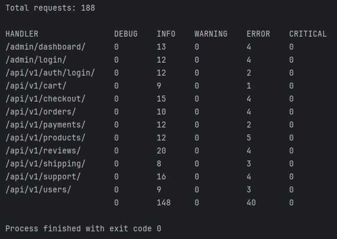
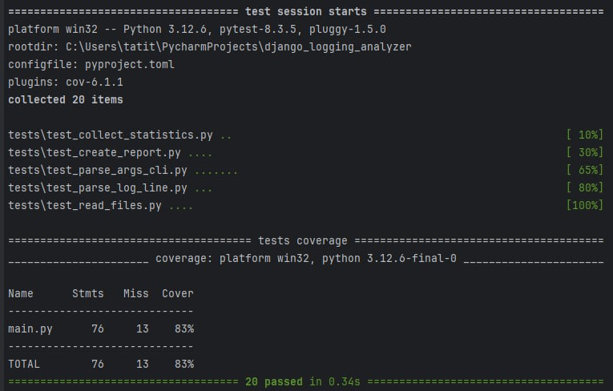

# Анализ журнала логирования.

cli-приложение, которое анализирует логи (~3M запросов) django-приложения и формировать отчеты.
Отчет выводится в консоль.

Пример вывода отчёта:



Покрытие кода тестами



## Инструкция формирование отчёта

1. Пример c файлами из данного проекта

```
python3 main.py logs/app1.log logs/app2.log logs/app3.log --report handlers
```

## Тестирование

1. Создать .lock-файл с зависимостями

```shell
poetry update
```

2. Запуск тестов:

```
pytest --cov=main tests/
```

### Pre-commit

[Pre-commit](https://pre-commit.com/) - это фреймворк для запуска хуков (инструментов) перед созданием коммита. Pre-commit использует файл конфигурации, чтобы определить, какие хуки запускать и как их запускать.

`pip install pre-commit==3.8.0`(установить прекоммит)

`pre-commit install`(добавить прекоммит)

`git add .pre-commit-config.yaml`(добавить git прекоммит)

`pre-commit run --all-files`(запустить без коммита)

`git commit --no-verify -m "<message>"` (пропустить выполнение хука при коммите)
