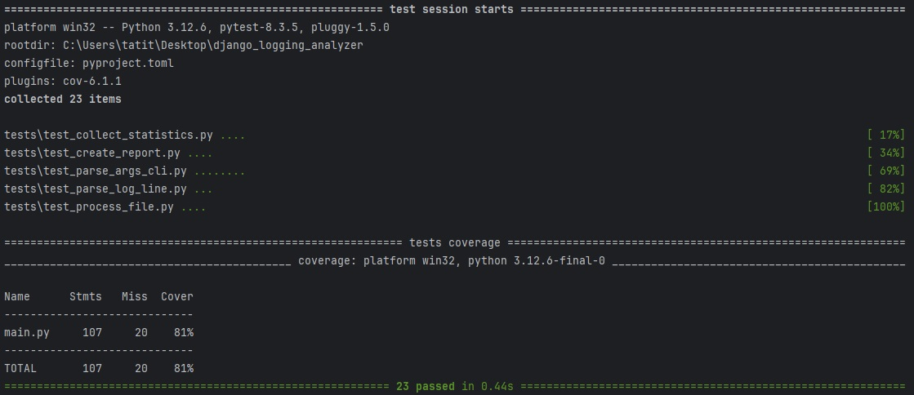

# Анализ журнала логирования.

cli-приложение, которое анализирует логи (~3M запросов) django-приложения и формировать отчеты.
Отчет выводится в консоль.

Пример формирование отчёта:

```
python3 main.py logs/app1.log logs/app2.log logs/app3.log --report handlers
```

Пример вывода:


Запуск тестов:

```
pytest --cov=main tests/
```

Покрытие кода тестами

